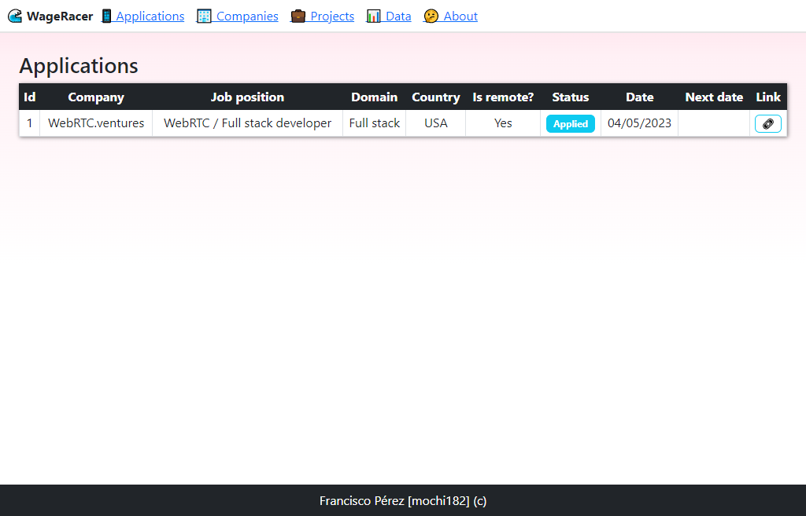

# 🌊 WageRacer

This is an application designed to help track job applications and other relevant information for job seekers. The app allows users to keep track of job applications, including the company, job position, and domain, as well as contacts at these companies and any reviews or responses received.

## 🚀 Technologies Used

The app is built using Node.js, ExpressJS, and Bootstrap.

## 🖼️ Screenshots

  

## 🌟 Features

* Track job applications, including company, job position, and domain
* Keep track of contacts at companies
* Track reviews and responses

## 🎥 Demo

The app is currently in development and will be deployed soon.

## 🤔 Challenges

One of the biggest challenges faced in building this app was attempting to create a single CRUD for all database tables. While this approach is not secure, it was an interesting challenge to attempt.

## 🔮 Future Work

Future work on this app will include switching the frontend to Svelte and implementing diagrams and graphs to better analyze progress.